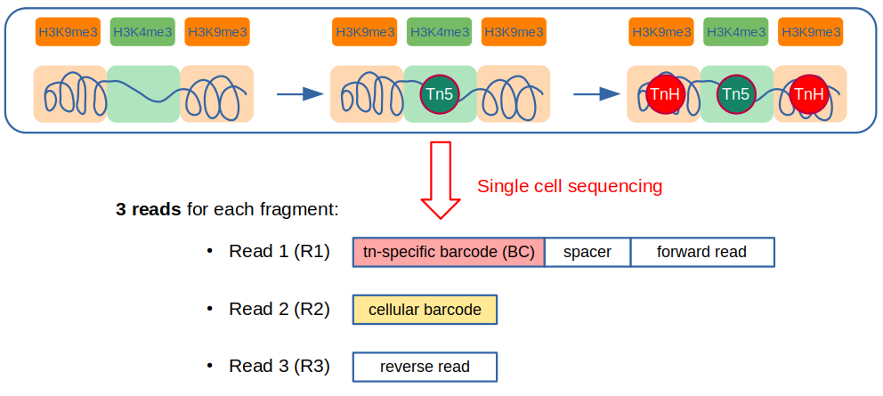

# scGET sequencing

# Configuration management
`scGET` allows the configuration of different parameters. The `config.yaml` file contains the default setting of each parameter. However, each default setting can be configured differently, directly from terminal. Here you can see a visual representation of configurable parameters needed for a personalyzed analysis.

### 1. input_list

The `input_list` must be a text file. Each line has to indicate the name of one of the fastq files. The `input_list` is accepted in two fromats:
1. *name_of_the_file* + *read_number*: read numbers are explicitly expressed for each file to each file:
> sample_S1_L001_R1_001.fastq.gz 1
> 
> sample_S1_L001_R2_001.fastq.gz 2
> 
> sample_S1_L001_R3_001.fastq.gz 3
> 
> sample_S1_L002_R1_001.fastq.gz 1
> 
> sample_S1_L002_R2_001.fastq.gz 2
> 
> sample_S1_L002_R3_001.fastq.gz 3
    

2. *name_of_the_file*: each line of the `input_list` indicates only the name of the file. A simple script will be in charge of searching for the pattern `_R1`,`_R2`, or `_R3` within each file name, in order to assign the number of read:
> sample_S1_L001_R1_001.fastq.gz 
> 
> sample_S1_L001_R2_001.fastq.gz 
> 
> sample_S1_L001_R3_001.fastq.gz 
> 
> sample_S1_L002_R1_001.fastq.gz 
> 
> sample_S1_L002_R2_001.fastq.gz 
> 
> sample_S1_L002_R3_001.fastq.gz 

### 2. input_path

The path for the input files must be expressed.

### 3. cell_number
The `cell_number` parameter accounts for the number of cellular barcodes extracted by `umi_tools`. By default `cell_number`= 5000.
### 4. genome
The path for an indexed genome is necessary for the allignment step. It may be more convenient to modify the `genome` parameter directly from the `config.yaml` file.
### 5. scatacc_path
It is necessary to clarify the path for `scatACC` directory in order to perform the deduplication step. It may be more convenient to modify the `scatacc_path` parameter directly from the `config.yaml` file.
### 6. bed_file
This parameter is mandatory for the peak count step. It may be more convenient to modify the `bed_file` parameter directly from the `config.yaml` file.
### 7. binary
If `binary`= False, it enables the selection of output counts over intervals instead of binary data. `binary`= True by default.
### 8. sample
Sample name can be clarified thanks to `sample` parameter. If sample name is not indicated, `sample` is equal to the name of the last folder of the `input_path`:

Example:

`input_path`= ${HOME}/fastq/clone12 &#8594; `sample`=clone12

While if the `input_path` is not indicated (i.e. input files are located in your current folder), `sample`= `scGET_sample` by default.

Example:

`input_path`= '' &#8594; `sample`=scGET_sample
### 9. output_path
It indicates where `scGET` results will be stored: resulting files will be stored in a folder named after the sample name.

Example:
- `output_path`= ${HOME}/results
- `sample`= scget_files

Finally, each file can be found at `${HOME}/results/scget_files` path.
